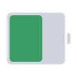
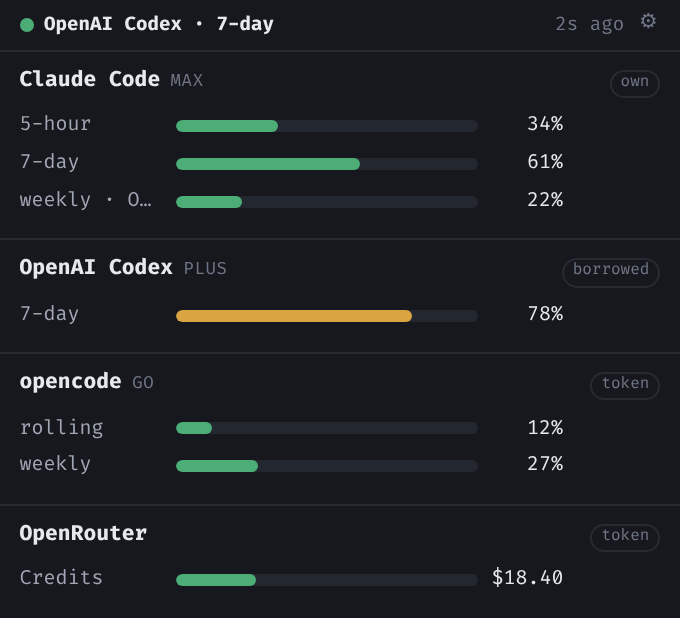
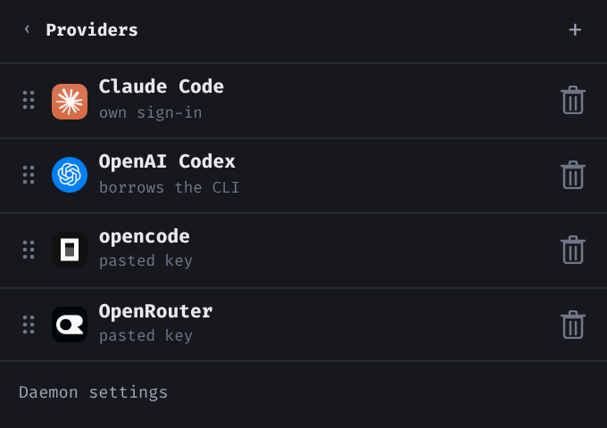

<p align="center">
  
</p>

<h1 align="center">Usage Watcher</h1>

<p align="center">
  How much of your AI subscriptions you have left — Claude Code, OpenAI Codex,
  opencode and OpenRouter — in one small window that is always a click away.
</p>

<p align="center">
  
</p>

If you use more than one of these, there is no single answer to "am I about to
run out?" Each vendor keeps its own number, in its own place, and the one that
matters — the 5-hour window that resets mid-afternoon — is usually the one you
find out about by being cut off.

This puts all of them on one screen, keeps them current, and tells you before
you hit a wall rather than after.

## What you get

- **Every limit in one place.** Rolling windows, weekly caps, per-model caps,
  prepaid balances. Green while there is room, amber when there is not much, red
  when there is trouble.
- **A live figure without opening anything** — in the menu bar on macOS, the
  tray tooltip on Windows, the top bar on GNOME. Whichever provider is closest
  to its limit is the one shown.
- **A notification when a meter crosses into warning or critical.** Once, when
  it crosses — not once a minute for the next four hours.
- **Nothing to run first.** The part that does the polling lives inside the app.

## Getting started

Grab the zip for your platform from
[Releases](https://github.com/xiaodongw/usage-watcher/releases/latest), unzip,
and double-click **usage-watcher**. Nothing to install, no service to start,
nothing left behind if you delete the folder. There is no macOS build yet — a
desktop app cannot be cross-compiled, so each one has to be built on its own
machine; `scripts/package.sh` produces the same zip from a checkout.

It puts an icon in the tray or menu bar. Click it for the panel.

The first screen is empty, with an **Add provider** button. Pick a provider and
it offers the ways you can sign in to that one, greying out any that cannot work
on this machine and saying why. Choose the browser sign-in and your real browser
opens; come back when it is done and the provider is being watched.

<p align="center">
  
</p>

**Configure** in the tray menu is where you go afterwards — to add more, drag
them into the order you want, or remove one. Removing deletes its stored
credential too, so removed means removed.

## What it watches

| | what it shows you |
|---|---|
| **Claude Code** | the 5-hour session window, the weekly limit, and per-model weekly caps |
| **OpenAI Codex** | your ChatGPT plan's rolling 7-day limit, plus credits if the plan has them |
| **OpenRouter** | credits left, any spending cap on the key, and spend this month |
| **opencode** | rolling, weekly and monthly windows — on the **Go** plan only |

Two quirks worth knowing before you read a bar. A free OpenRouter key has no
balance and no cap, so its tile says there is nothing to measure rather than
drawing an empty one. And opencode publishes usage only on the Go subscription —
Zen proper is pay-as-you-go with no usage API at all, so a Zen key gets an
honest "nothing to report" rather than a red error.

## Your credentials stay yours

Signing in stores a credential in the **Windows Credential Manager**, the
**macOS Keychain**, or a file only your account can read on Linux. Never in a
config file, never sent anywhere but to the provider it belongs to.

If you would rather not sign in again at all, most providers can **borrow the
sign-in your existing CLI already has**. That is strictly read-only: the app
reads the file the vendor's own tool wrote, never writes to it, and never
refreshes a borrowed token — refreshing one is what would sign you out of your
real CLI.

Nothing about your usage leaves your machine. The app talks to the providers and
to nothing else.

## In a terminal

The same numbers without opening anything:

```sh
uw            # a table
uw --json     # for a script, or a status bar
```

`uw` sits in the same folder as the app and needs no installing. So does `uwd`,
the collector on its own — for a headless box, or for keeping your credentials
inside WSL while the panel runs on Windows.

## Where it runs

| | |
|---|---|
| **Windows** | tray icon and a popover panel |
| **macOS** | menu-bar app, with the figure beside the icon |
| **Linux** | a [GNOME Shell extension](gnome-extension/README.md) — a real panel indicator, not a tray shim |
| **Android, iOS** | *planned* — the shells build, but nothing has been tested on a device yet, so they are not part of a release |

---

## Documentation

| | |
|---|---|
| [Configuration](docs/CONFIGURATION.md) | the config file, sign-in modes, where credentials live, how often it polls |
| [Architecture](docs/ARCHITECTURE.md) | the collector and its viewers, and the HTTP + SSE API between them |
| [Developing](docs/DEVELOPING.md) | running from source, the fast dev loop, the test suites |
| [Building](docs/BUILDING.md) | prerequisites per platform and target, and which combinations are impossible |
| [Adding a provider](docs/ADDING-A-PROVIDER.md) | the adapter interface — one file, and nothing downstream to edit |
